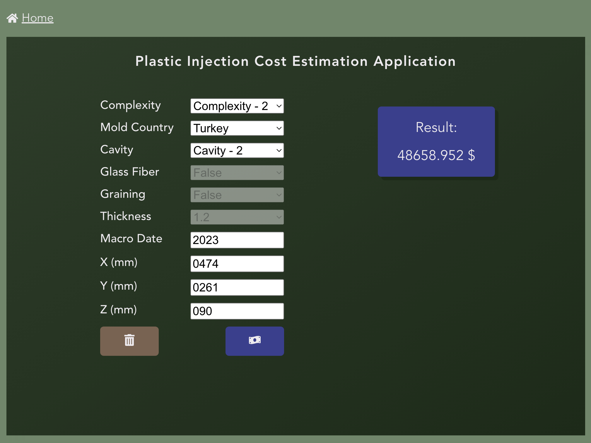
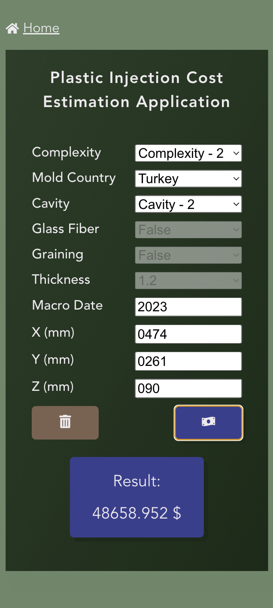

<h1 align="center">COST ESTIMATION</h1>
<p align="center">
    <a href="https://github.com/hidayet-aydin/api-based-blog-project/blob/main/LICENSE.txt"></a>
</p>
<br/>





## Electron

```bash
npm i --save-dev concurrently electron electron-builder wait-on
```

## License

MIT Licensed.

Copyright © Hidayet AYDIN 2026.
